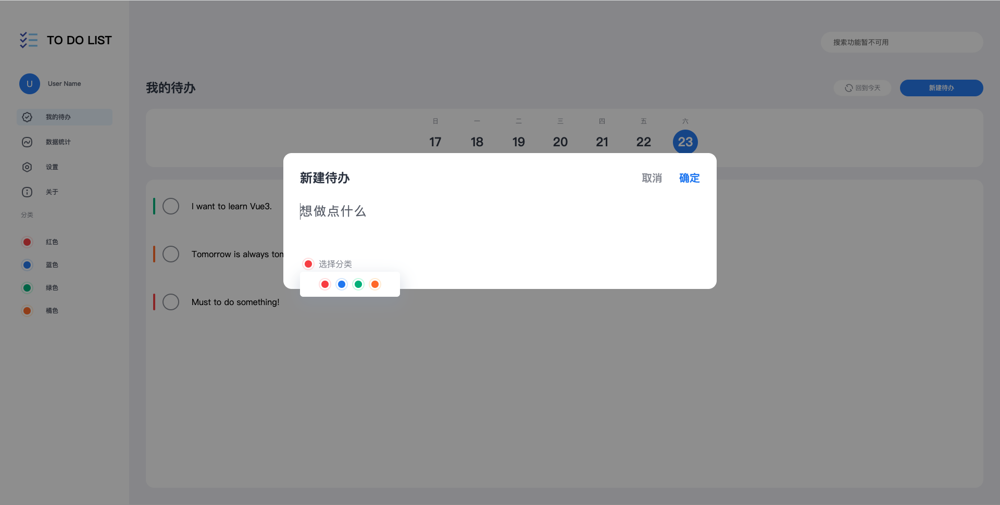
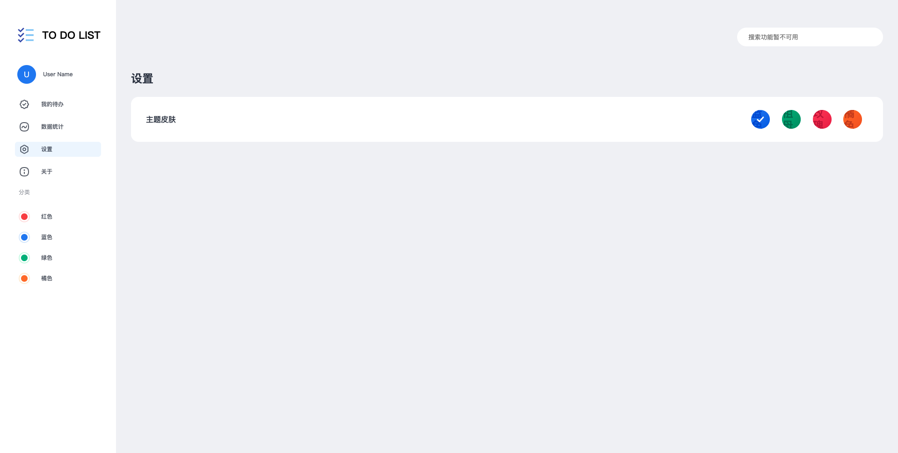

# notes-app

## Project setup
```
npm install
```

### Compiles and hot-reloads for development
```
npm run serve
```

### Compiles and minifies for production
```
npm run build
```

### Lints and fixes files
```
npm run lint
```

### Introduction
1. 我的待办


2. 新建待办


3. 日历


4. 数据统计


5. 设置 - 主题换色


### TodoLists

+ 分类功能

+ 搜索功能

+ 账号登录

+ 优化 scss 全局变量引入方式，尝试一次引入，全局应用，而不是每次在使用时引入一次